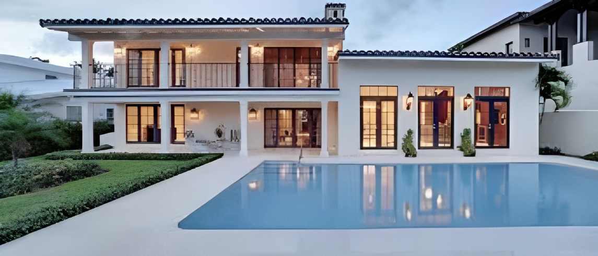

# **Data Scientist | Machine Learning Engineer**

**Technical Skills :** Python, SQL, Machine Learning,  Deep Learning, Data Analysis, Data Visualization

## **Education** 
Undergraduate student, Artifical Intelligence Engineering, Mansoura University.

## **Work Experience**
* Machine Learning Engineer @ Freelancer.com - (Mar 2023 - Present)
* Data Scientist @ Freelaner.com - (Mar 2023 - Present)

Check my projects in my [Freelancer Profile](https://www.freelancer.com/u/MohammedSalahMS)

## **Projects**
#### Advanced Regression Model for Predicting Housing Prices
In this project, we will build an advanced regression model to predict housing prices. The dataset used for this project is hosted on [Kaggle](https://www.kaggle.com/competitions/house-prices-advanced-regression-techniques) which contains information on various factors that can influence the price of a house

  

Project Goals:
The goals of this project are as follows:

* Build a regression model that accurately predicts housing prices based on the available features in the Boston Housing dataset.
* Explore and analyze the dataset to identify important features and patterns that can improve the model's performance.
* Evaluate the model's performance using various metrics and techniques, such as cross-validation and hyperparameter tuning.
* Use the model to make predictions on new, unseen data and interpret the results.

Check The Project on [Github](https://github.com/MohammedSaLah-Eldeen/Supervised-Learning-Projects/tree/main/Regression/Houses%20Prices%20-%20Advanced%20Regression%20Techniques)

## **About me**
Since I was a little kid, I was always fascinated by computers and technology
as they made us able to make amazing art such as image manipulation and graphic
design. I started learning about design when I got into high school I learned
various software like Adobe Photoshop and Illustrator aspiring to be a 
graphic designer. However, on seeing AI-generated art, I was deeply captivated by the amazing designs generated from machines made of wires and electricity. 
After reading more and more about AI in all different kinds of fields, I couldn't stop my
curiosity of learning more and more about this field. And here I am.

#### [LinkedIn](https://www.linkedin.com/in/mohammed-s-3b9211260/)  -  [Github](https://github.com/MohammedSaLah-Eldeen)
